# ML Papers
This repo contains notes and short summaries of some ML related papers I come across, organized by subjects and the summaries are in the form of PDFs.

## Object

### 文献一 （Ppaer One）: 

[A Survey of Deep Learning-Based Object Detection](A_Survey_of_Deep_Learning-Based_Object_Detection.pdf)

本文比较全面的介绍了目前应用在很多场景中不同的目标检测器，但并非只针对在自动驾驶感知上的应用。 

##### Pre-existing domain-specic image object detectors usually can be divided into two categories, the one is two-stage detector, the most representative one, Faster R-CNN [8]. The other is one-stage detector, such as YOLO [9], SSD [10]. Two-stage detectors have high localization and object recognition accuracy, whereas the one-stage detectors achieve high inference speed.

	Two-stage detector: 
		R-CNN, FAST R-CNN, FASTER R-CNN, MASK R-CNN
	One-stage detector:
		YOLO, YOLOv2, YOLOv3, YOLOv4, YOLOv5, SSD, DSSD. RetinaNet, M2Det

#### 1. Two-Stage Detectors:

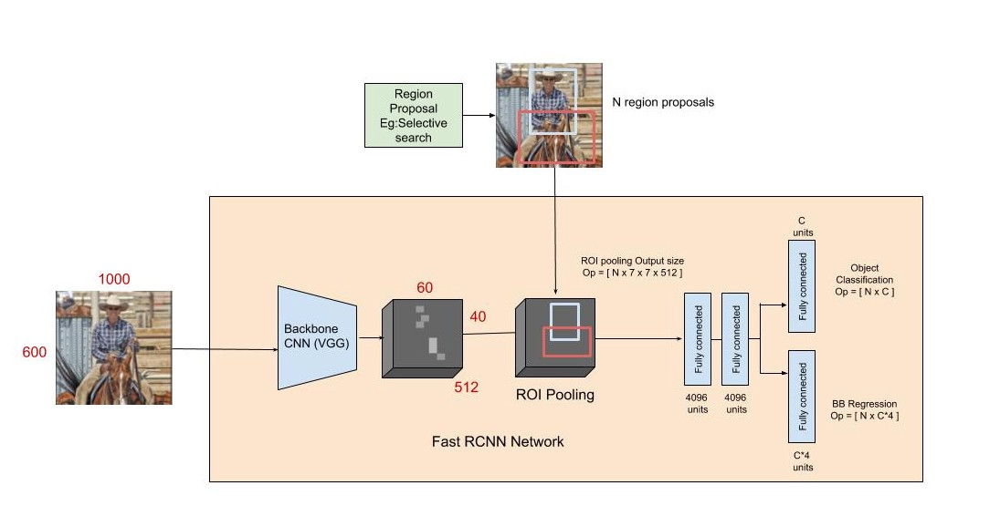

	a. R-CNN:

R-CNN包含四个模组。第一个模组生成与类别无关的区域提案；第二个模组会从每个提案中提取出一个固定长度的向量；第三个模组是利用线性SVM分类器对图像中的目标进行分类；最后，第四个模组会通过边界框回归器来对目标的边界框进行预测标记。一开始，在生成区域提案时候使用的是选择搜索(Selective Search)的方式，之后利用CNN在提案区域中提取出4096维的特征向量。因为CNN需要固定长度的输入向量，所以R-CNN提案区域使用了固定的227*227 pixel的输入大小。特征提取网络是由5个卷积层和2个全连接层组成，并且所有的CNN参数在所有categories中都是共享的，然后每个category都会训练一个独立的SVM分类器。最后对目标进行识别。

R-CNN的问题

		i. 需要很长的训练时间
		ii. 无实时(Real-Time)
		iii. 选择搜索算法是固定的算法，在提出区域提案是无学习过程，可能会生成不好的区域但改进有局限

	a. FAST R-CNN

在R-CNN提出的一年后，Fast R-CNN便诞生了。因为R-CNN的ConvNet对每个区域提案forward pass不共享计算，而且会花费很多的时间在SVM的分类上，所以R-CNN在表现上有很大的局限性。在Fast R-CNN中，特征一开始便在整张图像中被提取出来然后传递到interest (RoI) pooling layer进行池化得到固定大小的特征，这些特征之后输入到全连接层进行分类和边界框的标记。Fast R-CNN相比R-CNN有效减少了计算量和存储空间。

	a. Faster R-CNN

三个月之后，Faster R-CNN接着又被提出。Faster R-CNN更新使用了RPN(Region Proposal Network)：fully convolutional network to efficiently predict region proposals with a wide range of scales and aspect ratios. RPN替代了前两个算法中使用的选择搜索（Selective Search），因为选择搜索耗费大量计算时间而RPN正是缩短了在提出区域提案所使用的时长。RPN会分享全图卷积特征以及一层常见的卷积检测网络从而加速了提案区域的生成。另外，针对不同大小的目标进行检测，Faster R-CNN使用了多尺度的anchors，这一步大大简化了生成不同区域提案的过程。
Faster R-CNN在识别的准确率和效率上较Fast R-CNN都有显著的改进与提高。

#### 2. One-Stage Detectors:

	a. YOLO (You Only Look Once):

YOLO的提出是在Faster R-CNN之后。YOLO可以完成实时监测：第一，一张图像仅预测少于100个边界框（Fast R-CNN使用选择搜索一张图像预测2000个区域提案）；第二，YOLO将检测问题构架成一个回归问题，所以这个集成的架构会从输入的图像中直接提取特征然后预测边界框和每个目标类的概率。YOLO在Titan X GPU上运行为45fps with no batch processing, 同比R-CNN为0.5fps，Faster R-CNN为7fps。
YOLO首先将输入的图像切割为S*S的格子用来检测目标的所在的中心点。

Confidence的得分是通过将二者相乘，P(object) 代表了边界中存在一个目标的概率，IOU(intersection over union) 则表示存在那个目标的准确率。在格子中的每个单元会预测B个边界框（x, y, w, h）以及他们的confidence scores，同时还会预测C-维的C类的分类概率。特征提取网络是由24个卷基层和2个全连接层组成。为了获得更加细粒度的视觉信息，在检测阶段预训练将把输入的图像的分辨率224*224进行双倍的提升。
YOLO的最大问题在于无法精准的对目标进行定位，其中偏差中的最大问题就是在此。相比Fast R-CNN与Faster R-CNN，YOLO的准确率显著偏低。
	
	b. YOLOv2
	YOLOv2是YOLO的升级版本

1. Batch Normalization
YOLOv2在每个卷积层前添加了一个BN层（输出同样分布的激活）来加快网络的收敛和帮助regularize模型。
2. High Resolution Classifier
在YOLO的backbone中，输入图像的分辨率被提升两倍，网络需要调节,这个问题通过加入一个fine-tuning的过程。
3. Convolutional with Anchor Boxes
YOLOv2中加入使用了anchor boxes，先移除掉全连接层，然后对每一个anchor box预测类与目标。这一步提升了7%的召回率。
4. Predicting the Size and Aspect Ratio of Anchor Boxes Using Dimension Cluster
YOLOv2利用了K-means clustering的机器学习算法，在数据集中提前训练分出好的anchor box的数据来提高预测bounding box的准确率。
5. Fine-Grained Features
在图像中定位较小的目标是，高分辨率特征图可以提供有用的信息。与ResNet相似，YOLOv2将高分辨率与低分辨率的特征结合堆叠相邻特征到不同的频道来提升性能。
6. Multi-Scale Training
为了让网络在面对不同大小的图像训练时具有很好的鲁棒性，每10个batch会加入一个不同尺度的图像，从而让网络可以预测不同分辨率的图像。

YOLOv2新提出了Darknet-19分类的backbone（19层卷积+5 max pooling layers）。结合之前的改进YOLOv2可以在高处理率的同时保证很高的识别准确率。

	c. YOLOv3

YOLOv3在YOLOv2的基础上进行了改进。首先YOLOv3使用了多标记分类（independent logistic classifiers）来适应更复杂的数据集；第二，YOLOv3应用了三种不同尺度的特征地图来对边界框预测，最后一层卷基层会预测一个3维的tensor涵盖对类的预测、目标性、和边界框；第三，YOLOv3提出了一个启发于ResNet的更深更鲁棒的特征提取器 --- Darknet-53。
因为多尺度的预测优势，YOLOv3可以检测到更多小体积的目标，但相对地在中、大体积目标的预测差一些。
	
	d. YOLOv4

https://medium.com/@riteshkanjee/yolov4-superior-faster-more-accurate-object-detection-7e8194bf1872

Backbone: CSPDarknet53

Neck: PANet (Path Aggregation Network) 路径聚合网络

Head: YOLOv3

Bag of Freebies/Bag of Specials

	e. YOLOv5

https://mc.ai/yolo-v5%E2%80%8A-%E2%80%8Aexplained-and-demystified-2/

	f. SSD

SSD --- Single-Shot Detector可以直接预测类的得分和边界框的偏移量。默认的边界框在每个特征图中有不同的大小与长宽比。

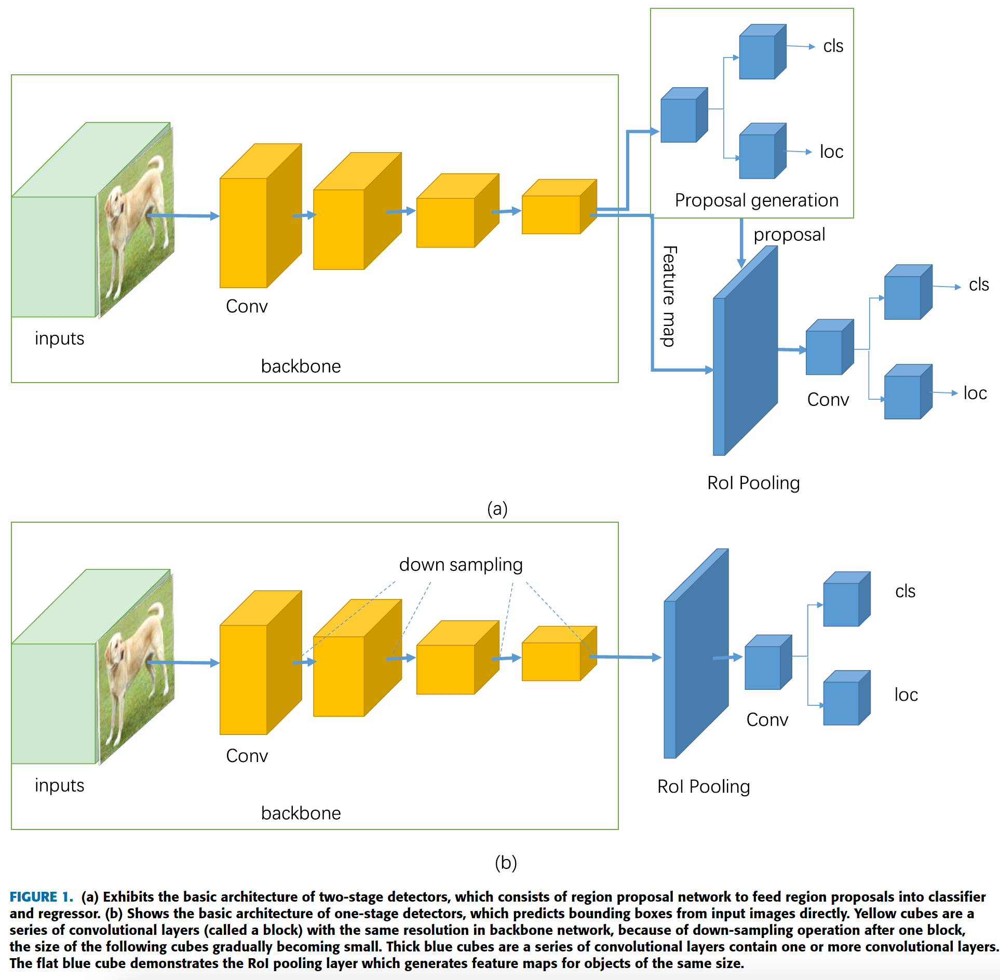

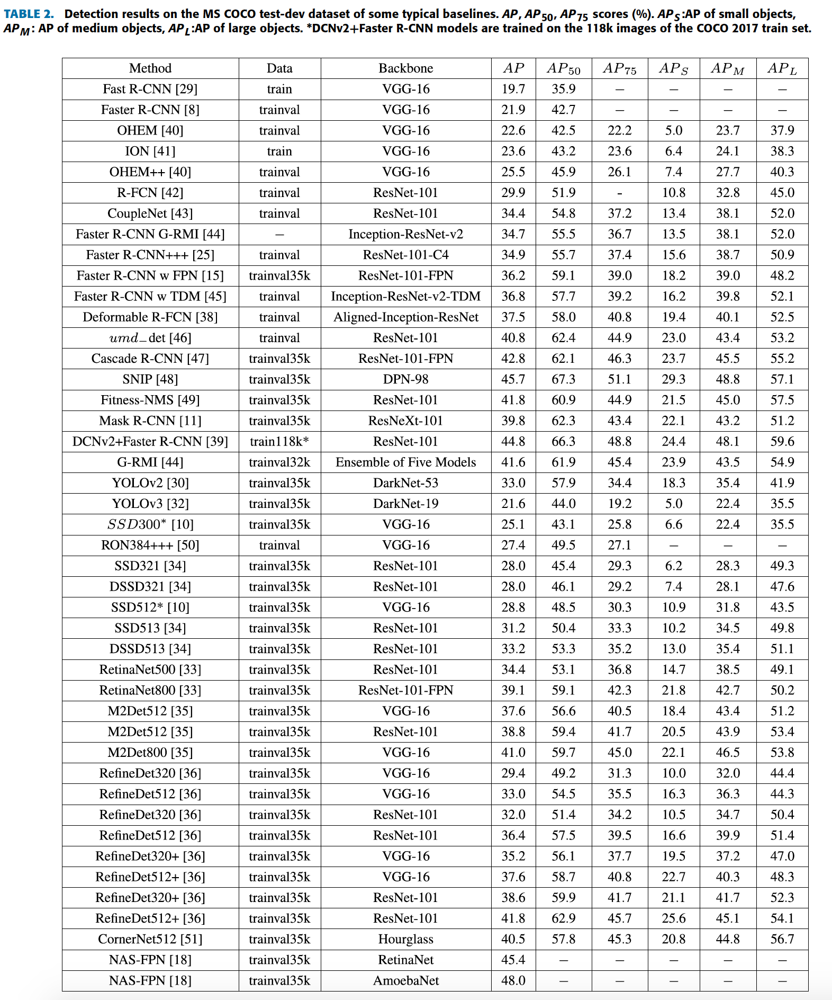

### 文献二（Paper Two）: 

[Stereo R-CNN based 3D Object Detection for Autonomous Driving](Stereo_R-CNN_based_3D_Object_Detection_for_Autonomous_Driving.pdf) CVPR 2019
[code](https://github.com/HKUST-Aerial-Robotics/Stereo-RCNN)

#### 港科大与大疆

本文提出了使用双目相机对目标检测进行3D识别，使用的是Stereo R-CNN的网络。
通过充分利用立体图像中的稀疏和密集，语义和几何信息，我们提出了一种用于自动驾驶的3D对象检测方法。我们的称为立体声R-CNN的方法扩展了用于立体声输入的Faster R-CNN，以同时检测和关联左右图像中的对象。我们在立体区域提议网络（RPN）之后添加额外的分支，以预测稀疏的关键点，视点和对象尺寸，将其与2D左右框组合以计算出粗略的3D对象边界框。然后，我们通过使用左右RoI进行基于区域的光度对齐来恢复准确的3D边界框。我们的方法不需要深度输入和3D位置监督，但是优于所有现有的完全监督的基于图像的方法。在具有挑战性的KITTI数据集上进行的实验表明，在3D检测和3D定位任务上，我们的方法都比基于现有立体声技术的方法好30％左右。

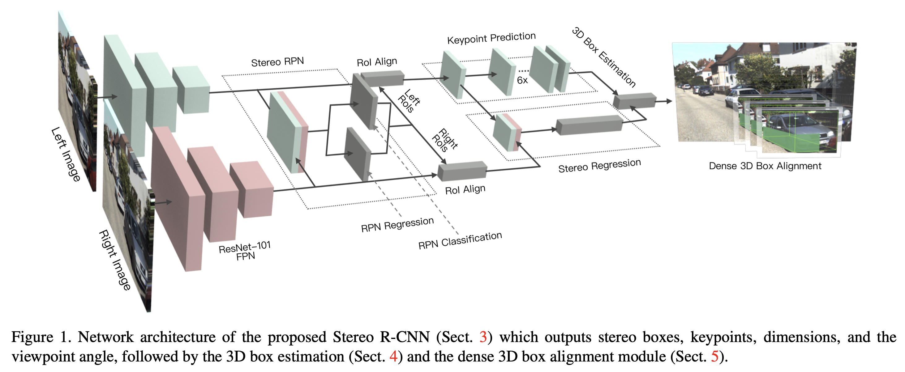

### 文献三（Paper Three）:

[SimpleDet A Simple and Versatile Distributed Framework for Object Detection and Instance Recognition](SimpleDet_A_Simple_and_Versatile_Distributed_Framework_for_Object_Detection_and_Instance_Recognition.pdf)
[code](https://github.com/tusimple/simpledet)

#### 图森 (TuSimple) 公司发表的关于目标识别的神经网络

本文提出了一种称为SimpleDet的高效开放源对象检测框架，该框架可在消费级硬件上大规模培训最新的检测模型。 SimpleDet支持最佳实践的最新检测模型。 SimpleDet还支持开箱即用的线性扩展的分布式训练。

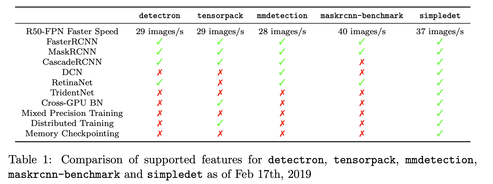

### 文献四（Paper Four）:

[PointPillars Fast Encoders for Object Detection from Point Clouds](PointPillars_Fast_Encoders_for_Object_Detection_from_Point_Clouds.pdf)
[code](traveller59/second.pytorch)
	
#### 来自nuTonomy 安波福旗下的公司
	
此文主要是对利用点云进行目标检测与识别似的应用进行研究，并对点云的分解及传递途径的方法进行了创新与研究。
在公司后期开始部署LIDAR进行点云的采集是可参考。

点云中的对象检测是许多机器人应用程序（例如自动驾驶）的重要方面。在本文中，我们考虑将点云编码为适合下游检测管道的格式的问题。最近的文献提出了两种类型的编码器。固定编码器趋向于快速但会牺牲准确性，而从数据中学习的编码器则更准确但速度较慢。在这项工作中，我们提出了PointPillars，这是一种新颖的编码器，它利用PointNets学习以垂直列（柱）组织的点云的表示形式。尽管编码的特征可以与任何标准的2D卷积检测体系结构一起使用，但我们进一步提出了精益的下游网络。大量的实验表明，就速度和准确性而言，PointPillars的性能均优于以前的编码器。尽管只使用了激光雷达，但我们的完整检测管线，即使在融合方法中，在3D和鸟瞰KITTI基准方面都明显优于现有技术。以62 Hz运行时可达到这种检测性能：运行时间提高了2-4倍。我们方法的更快版本与105 Hz的最新技术匹配。这些基准表明PointPillars是点云中对象检测的适当编码。

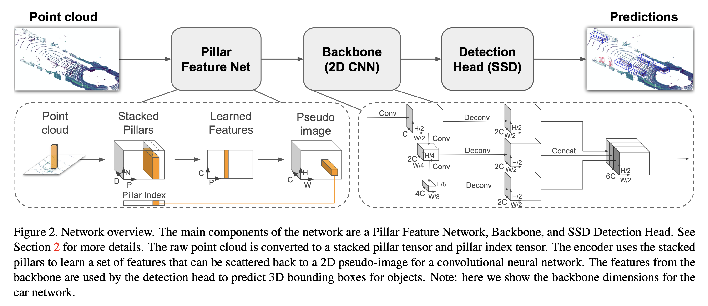

### 文献五（Paper Five）:

[Complex-YOLO Real-time 3D Object Detection on Point Clouds](Complex-YOLO_Real-time_3D_Object_Detection_on_Point_Clouds.pdf)
[code](AI-liu/Complex-YOLO)

#### 法里奥、伊尔默瑙理工大学

此文介绍了基于点云来实现3D目标检测的YOLO架构。
基于激光雷达的3D对象检测对于自动驾驶是不可避免的，因为它直接与环境理解联系在一起，因此为预测和运动计划奠定了基础。实时推断高度稀疏的3D数据的能力是除自动驾驶汽车以外的许多其他应用领域的不适定问题。增强现实，个人机器人或工业自动化。我们介绍了Complex-YOLO，它是仅在点云上的最先进的实时3D对象检测网络。在这项工作中，我们描述了一种网络，该网络通过特定的复杂回归策略来估计笛卡尔空间中的多类3D框，从而扩展RGB图像的快速2D标准对象检测器YOLOv2。因此，我们提出了一个特定的Euler-Region-Proposal Network（E-RPN），通过向回归网络中添加虚部和实部来估计对象的姿态。这最终会在封闭的复杂空间中发生，并避免了单角度估计所产生的奇异性。 E-RPN支持在培训过程中很好地推广。我们在KITTI基准套件上进行的实验表明，就效率而言，我们的性能优于目前领先的3D对象检测方法。我们比最快的竞争对手快五倍以上，从而为汽车，行人和骑自行车的人取得了最先进的成绩。此外，我们的模型能够高精度地同时估算所有八个KITTI类，包括货车，卡车或行人。

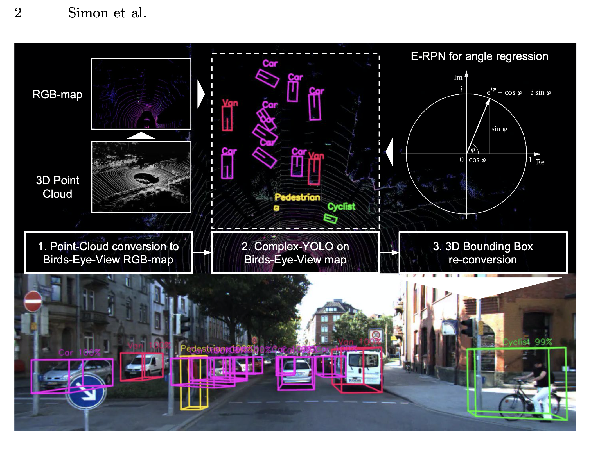

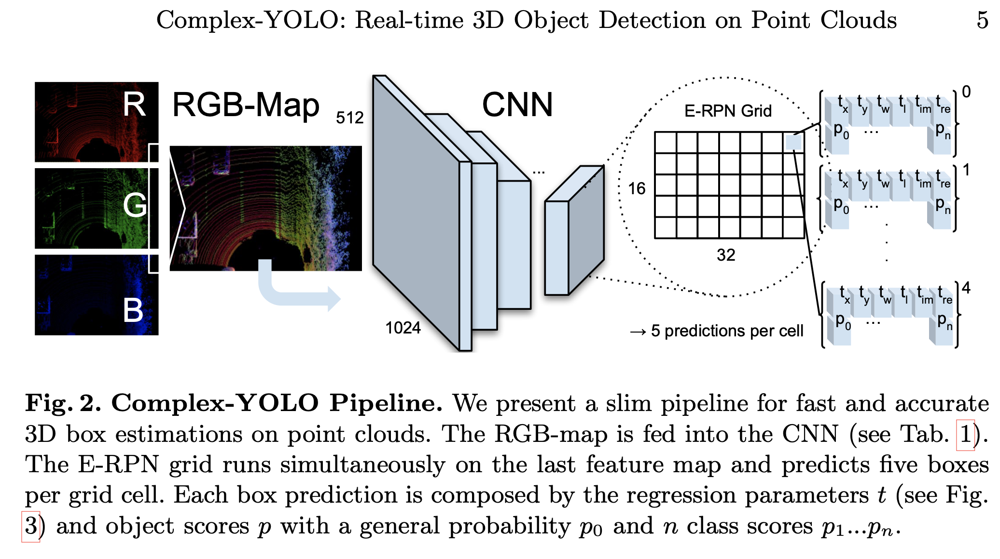

### 文献六（Ppaer Six）:

[SqueezeDet Unified, Small, Low Power Fully Convolutional Neural Networks for Real-Time Object Detection for Autonomous Driving](SqueezeDet_Unified,_Small,_Low_Power_Fully_Convolutional_Neural_Networks_for_Real-Time_Object_Detection_for_Autonomous_Driving.pdf)
[code](BichenWuUCB/squeezeDet)

#### 伯克利与Deep Scale 

目标检测是自动驾驶的关键任务。除了要求高精度以确保安全性之外，用于自动驾驶的目标检测还需要实时推理速度以确保及时的车辆控制，以及较小的模型尺寸和能效以实现嵌入式系统部署。
在这项工作中，我们提出了SqueezeDet，这是一种用于目标检测的完全卷积神经网络，旨在同时满足上述所有约束。在我们的网络中，我们不仅使用卷积层提取特征图，还使用它作为输出层来计算边界框和类概率。我们模型的检测管线仅包含一个神经网络的前向通过，因此速度非常快。我们的模型是完全卷积的，这导致了较小的模型尺寸和更好的能源效率。在达到与先前基准相同的精度的同时，我们的模型缩小了30.4倍，加快了19.7倍，并且能耗降低了35.2倍。

	SqueezeDet Detection Pipeline 

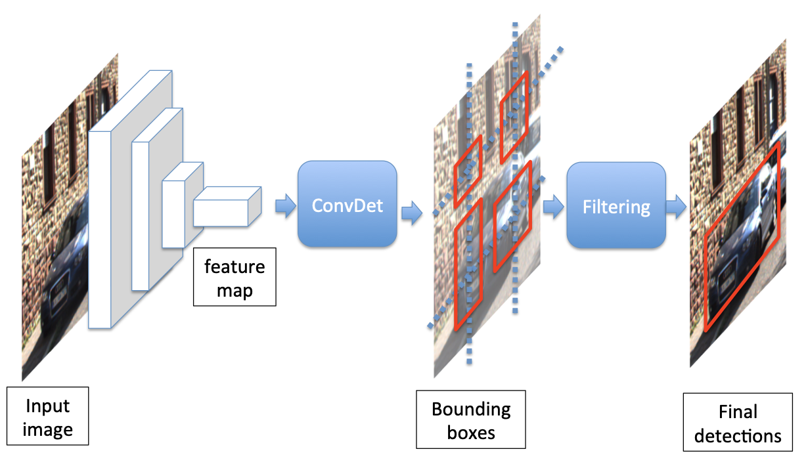

	SqueezeDet Bounding Box Transformation

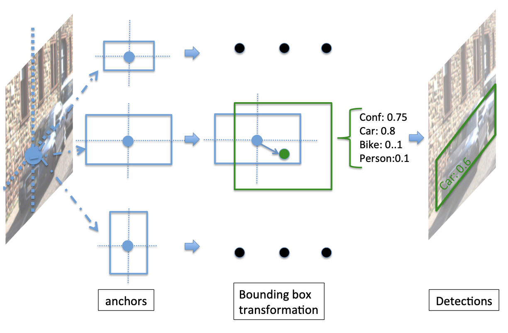

### 文献七（Paper Seven)：

[VoxelNet End-to-End Learning for Point Cloud Based 3D Object Detection](VoxelNet_End-to-End_Learning_for_Point_Cloud_Based_3D_Object_Detection.pdf)
[code](charlesq34/pointnet)

#### 苹果公司基于点云设计的VoxelNet来实现3维的目标检测应用。

在3D点云中对象的准确检测是许多应用程序中的中心问题，例如自主导航，客房服务机器人以及增强/虚拟现实。为了将高度稀疏的LiDAR点云与区域建议网络（RPN）连接，大多数现有的工作都集中在手工制作的特征表示上，例如鸟瞰图。在这项工作中，我们消除了对3D点云进行手动特征工程的需要，并提出了VoxelNet，这是一种通用3D检测网络，它将特征提取和边界框预测统一为一个单阶段，端到端的可训练深度网络。具体来说，VoxelNet将点云划分为等距的3D体素，并通过新引入的体素特征编码（VFE）层将每个体素内的一组点转换为统一的特征表示。这样，点云被编码为描述性体积表示，然后将其连接到RPN以生成检测。在KITTI汽车检测基准上进行的实验表明，VoxelNet在很大程度上优于基于LiDAR的最新3D检测方法。此外，我们的网络可有效识别具有各种几何形状的物体，从而仅基于LiDAR，就可以对行人和骑自行车的人进行3D检测，从而获得令人鼓舞的结果。

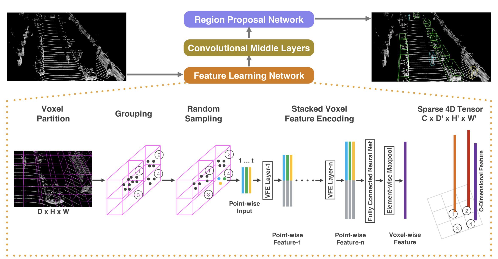

VoxelNet，这是一种通用的3D检测框架，它可以从点云同时学习判别性特征表示并以端到端的方式预测准确的3D边界框，如图2所示。苹果团队设计了一种新颖的voxel特征编码（VFE）层，通过将逐点特征与局部聚集特征相结合，可以在体素内进行点间交互。堆叠多个VFE层可以学习复杂的功能，以表征本地3D形状信息。具体来说，VoxelNet将点云划分为等距的3D体素，通过堆叠的VFE层对每个体素进行编码，然后3D卷积进一步聚合局部体素特征，从而将点云转换为高维体积表示。最后，RPN消耗体积表示并得出检测结果。这种高效的算法既受益于稀疏点结构，又受益于体素网格的高效并行处理。
