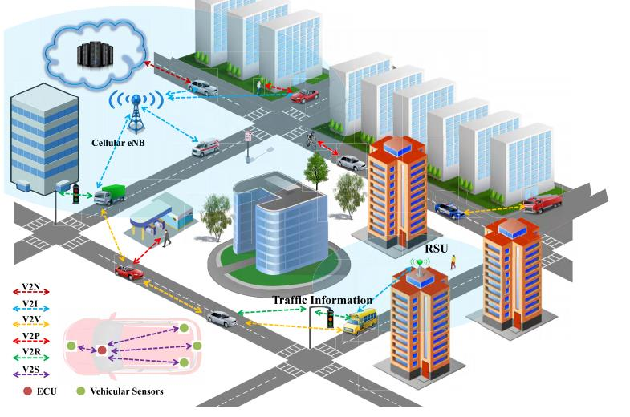
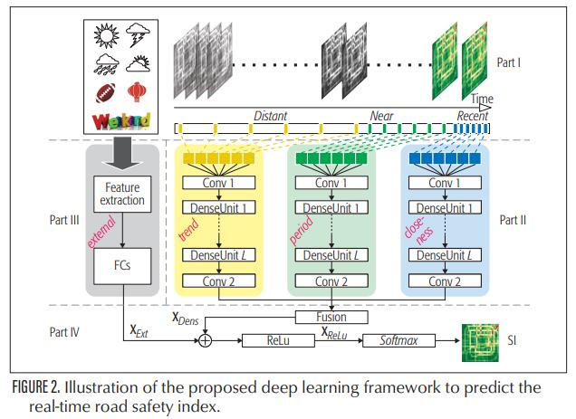
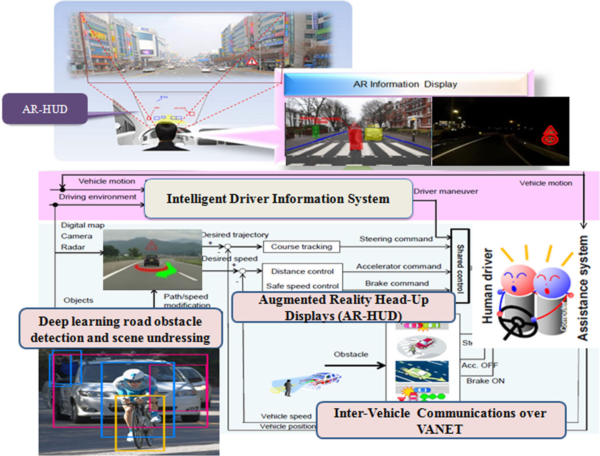

# ML Papers
This repo contains notes and short summaries of some ML related papers I come across, organized by subjects and the summaries are in the form of PDFs.

## V2X简介
[Artificial intelligence for vehicle to everything A survey](papers/Artificial_intelligence_for_vehicle_to_everything_A_survey.pdf)

这边文章介绍了利用人工智能解决V2X系统中各种研究工作的全面调查，总结了这些研究工作的贡献，并按应用领域进行了分类。并给出了当前面临的问题和挑战。

-Vehicle-to-Infrastructure (V2I)

-Vehicle-to-Vehicle (V2V)

-Vehicle-to-Pedestrian (V2P)

-Vehicle-to-Self (V2S) 

-Vehicle-to-Road side units (V2R)

图1. V2X应用场景

## 通信方式有两种：

-DSRC(Dedicated Short Range Communication)

-C-V2X(Cellular Vehicle-to-Everything)

## 人工智能与V2X

###  SAFETY AND COMFORT
[Vehicle Safety Improvement through Deep Learning and Mobile Sensing](papers/Vehicle_Safety_Improvement_through_Deep_Learning_and_Mobile_Sensing.pdf) IEEE Network 2018

这篇文章定义了两大挑战：

1. 驾驶安全分析

	a. 驾驶习惯分析

	b. 周边车辆、行人、交通标识、车道线的探测

2. 道路安全分析，提出了一个名为DeepRSI的深度神经网络框架，通过蜂窝网络采集车辆的GPS轨迹和传感器数据作为网络的输入，可以实现实时的道路安全预警。

[Driver information system a combination of augmented reality, deep learning and vehicular Ad-hoc networks](papers/Driver_information_system_a_combination_of_augmented_reality,_deep_learning_and_vehicular_Ad-hoc_networks.pdf)

提高交通安全性是智能交通系统(ITS)的重要目标之一。在以车辆为基础的安全系统中，预防事故比减少伤害的严重程度更可取。交通事故和交通拥堵等严重的交通问题要求发展新的运输系统。为了最大限度地提高道路交通安全水平和驾驶员的最佳舒适度，需要进行感性因素和人为因素的评价研究。预防事故的解决办法之一是提供司机周围环境的信息。增强现实平视显示器(AR-HUD)可以促进车辆和驾驶员之间的一种新的对话形式;并通过将周围的交通信息叠加在用户视图中来增强ITS功能，并保持驾驶员对道路的视图。在这篇文章中，我们提出了一个快速的基于深度学习的目标检测方法来识别和识别道路障碍类型，以及解释和预测复杂的交通情况。单一卷积神经网络在一次评估中直接从完整的图像预测感兴趣的区域和类概率。我们还调查了使用动态适形AR提示提高驾驶安全的潜在成本和收益。引入了一种新的AR-HUD方法来创建实时交互式交通动画，包括障碍物类型、放置规则和可见性，以及在车载显示器上的投影。该方法的新颖之处在于将全局和局部上下文信息集成到一个统一的框架中，以区分模糊检测结果，并通过将周围的交通信息叠加在用户视图和驾驶员视图中来增强模糊检测结果。这边论文通过人为因素评估和向司机展示周围信息提高车辆安全性和舒适性。论文中提到AR-HUD可以作为司机与车辆之间的一个桥梁，同时也提出了一个实时目标检测算法解决方案。

Cooperative Driving Information System

### COOPERATIVE PARKING

[Decision-Theoretic Cooperative Parking for Connected Vehicles an Investigation](V2X/papers/Decision-Theoretic_Cooperative_Parking_for_Connected_Vehicles_an_Investigation.pdf)

### SPEED ADVISORY

### Others
[A Deep Reinforcement Learning Framework to Combat Dynamic Blockage in mmWave V2X Networks](papers/A_Deep_Reinforcement_Learning_Framework_to_Combat_Dynamic_Blockage_in_mmWave_V2X_Networks.pdf)

[Deep neural network based resource allocation for V2X communications](papers/Deep_neural_network_based_resource_allocation_for_V2X_communications.pdf)

[Deep reinforcement learning based distributed vehicle position controls for coverage expansion in mmWave V2X](papers/Deep_reinforcement_learning_based_distributed_vehicle_position_controls_for_coverage_expansion_in_mmWave_V2X.pdf)

[Deep Reinforcement Learning Based Mode Selection and Resource Allocation for Cellular V2X Communications](papers/Deep_Reinforcement_Learning_Based_Mode_Selection_and_Resource_Allocation_for_Cellular_V2X_Communications.pdf)

[Driving policies of V2X autonomous vehicles based on reinforcement learning methods](papers/Driving_policies_of_V2X_autonomous_vehicles_based_on_reinforcement_learning_methods.pdf)

[Edge Based V2X Communications With Big Data Intelligence](papers/Edge_Based_V2X_Communications_With_Big_Data_Intelligence.pdf)

[huawei cv2x whitepaper for cooperative its cn](papers/huawei_cv2x_whitepaper_for_cooperative_its_cn.pdf)

[Intelligent network slicing for v2x services toward 5g](papers/Intelligent_network_slicing_for_v2x_services_toward_5g.pdf)

[Joint Optimization of Spectrum and Energy Efficiency Considering the C V2X Security A Deep Reinforcement Learning Approach](papers/Joint_Optimization_of_Spectrum_and_Energy_Efficiency_Considering_the_C_V2X_Security_A_Deep_Reinforcement_Learning_Approach.pdf)

[Optimizing Traffic Lights with Multi agent Deep Reinforcement Learning and V2X communication](papers/Optimizing_Traffic_Lights_with_Multi_agent_Deep_Reinforcement_Learning_and_V2X_communication.pdf)

[Traffic big data assisted V2X communications toward smart transportation](papers/Traffic_big_data_assisted_V2X_communications_toward_smart_transportation.pdf)